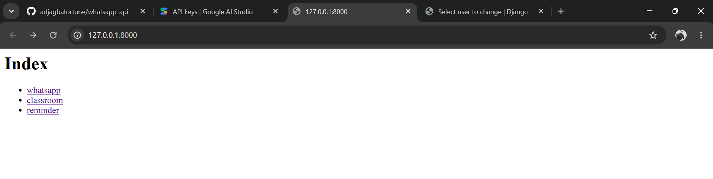
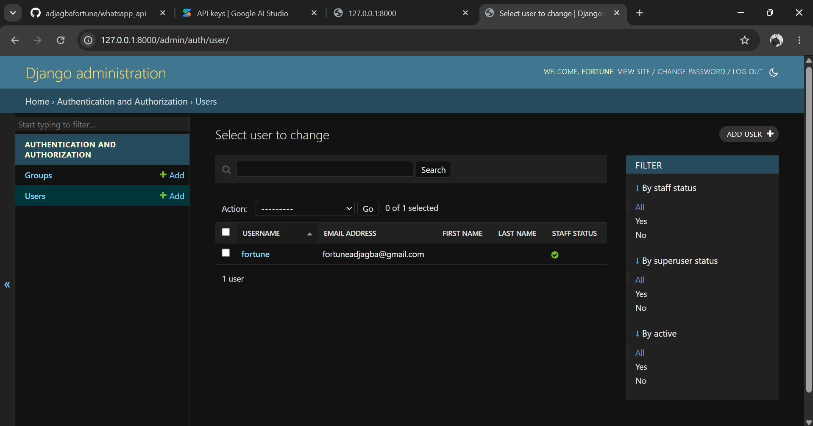

# WhatsApp API Backend (Django)

An extensible Django-based REST API that powers a WhatsApp automation bot, featuring a dynamic plugin architecture and OpenAI GPT integration.

 <br>
 <br>

## Features
* **Modular Plugin System:** Add new chat commands on the fly by dropping scripts into the `plugins/` directory.
* **AI-Powered:** Seamlessly integrates with OpenAI's GPT for natural conversational fallbacks.
* **Role-Based Access Control:** Built-in validation for Admin-only commands and user blacklisting.
* **Media Handling:** Process incoming images, videos, audio, and documents.

## Architecture & Workflow
This API acts as the orchestration layer. It expects webhooks from a WhatsApp client wrapper, processes the business logic or plugins, and dispatches responses back.

## Setup & Installation

1. **Clone & Navigate:**
```bash
   git clone https://github.com/adjagbafortune/whatsapp_api.git
   cd Whatsapp_api

```

2. **Install Dependencies:**

```bash
   pip install -r requirements.txt

```

3. **Environment Variables:**
Create a `.env` file in the root directory:

```env
   DJANGO_KEY=your_secret_key
   OPENAI_API_KEY=your_openai_key
   WHATSAPP_CLIENT_URL=your_whatsapp_node_client_url

```

4. **Database Migrations:**

```bash
   python manage.py migrate

```

## Creating Plugins

To add a command, create a Python file in `api/plugins/`:

```python
pluginInfo = {
    "command_name": "ping",
    "admin_privilege": False,
    "description": "Replies with pong.",
}

def handle_function(message):
    message.outgoing_text_message = "Pong!"
    message.send_message()

```

## 🛡️ License

This project is licensed under the [License MIT](LICENSE).